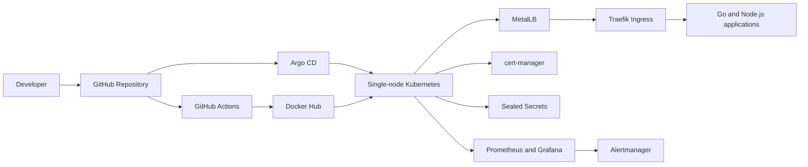

# Karem On-Prem DevOps Platform

[](https://github.com/egyhaty/karm-devops/actions/workflows/platform-validation.yml)
[](https://github.com/egyhaty/karm-devops/actions/workflows/automate-build-apps.yml)

A hands-on, production-inspired single-node on-premises Kubernetes platform demonstrating infrastructure automation, GitOps delivery, CI/CD, secure secret management, ingress, TLS, load balancing, and observability.

## What This Project Demonstrates

- Kubernetes platform administration on on-premises infrastructure.
- Infrastructure as Code with Terraform.
- Helm-based application packaging and deployments.
- GitOps application delivery with Argo CD.
- Automated application build and validation workflows with GitHub Actions.
- Container image publishing to Docker Hub.
- Ingress routing with Traefik.
- Bare-metal load balancing with MetalLB.
- TLS automation with cert-manager.
- Secret encryption and delivery with Sealed Secrets.
- Monitoring and alerting with Prometheus, Grafana, Alertmanager, node-exporter, and kube-state-metrics.
- Deployment of Go and Node.js sample applications.

## Architecture



## Platform Components

| Area | Components |
| --- | --- |
| Cluster | Kubernetes, CoreDNS, kube-proxy, kube-flannel, metrics-server |
| GitOps | Argo CD |
| Packaging | Helm |
| Infrastructure | Terraform |
| Ingress | Traefik |
| Load balancing | MetalLB |
| TLS | cert-manager |
| Secrets | Sealed Secrets |
| Observability | Prometheus, Grafana, Alertmanager, node-exporter, kube-state-metrics |
| Applications | Go and Node.js |
| Container registry | Docker Hub |
| Automation | GitHub Actions |

## Repository Structure

```text
.
├── .github/workflows/       # CI validation and application build workflows
├── argocd/                  # Argo CD applications and GitOps configuration
├── cert-manager/            # Certificate and issuer configuration
├── charts/                  # Helm charts
├── docs/                    # Supporting documentation
├── golang/                  # Go application manifests/source
├── monitoring/              # Prometheus, Grafana, and alerting configuration
├── nodejs/                  # Node.js application manifests/source
├── sealed-secrets/          # Sealed Secrets configuration
├── terraform/               # Infrastructure as Code
├── traefik/                 # Traefik configuration
├── .gitleaks.toml           # Secret scanning configuration
├── .yamllint.yml            # YAML lint configuration
├── SECURITY.md              # Security guidance
└── README.md
```

## Prerequisites

- Access to the target Kubernetes cluster.
- A working `kubectl` context with sufficient permissions.
- Terraform 1.7.x or a compatible newer version.
- Helm 3.x.
- Docker and access to the `egyhaty` Docker Hub namespace, when building images.
- Argo CD, cert-manager, MetalLB, Traefik, and Sealed Secrets installed when applying the related configuration.

Verify the local tools and cluster context:

```bash
terraform version
helm version
kubectl config current-context
kubectl get nodes
kubectl get pods -A
```

## Quick Start

Clone the repository and inspect the configuration:

```bash
git clone https://github.com/egyhaty/karm-devops.git
cd karm-devops
```

Validate Terraform and Helm configuration before applying changes:

```bash
terraform -chdir=terraform fmt -check -recursive
terraform -chdir=terraform validate
helm lint ./charts/<chart-name>
```

Apply infrastructure changes according to the relevant Terraform module documentation:

```bash
terraform -chdir=terraform init
terraform -chdir=terraform plan
terraform -chdir=terraform apply
```

Deploy or synchronize workloads through Argo CD. The exact application manifests and values are located under `argocd/`, `charts/`, `golang/`, and `nodejs/`.

> Replace placeholders such as `<chart-name>` with the actual chart directory. Do not commit kubeconfig files, private keys, passwords, or registry credentials.

## Delivery Flow

1. A change is committed and pushed to GitHub.
2. GitHub Actions validates platform configuration and builds application images.
3. Application images are published to Docker Hub using protected GitHub Secrets.
4. Argo CD observes the desired state in Git and synchronizes the Kubernetes cluster.
5. Traefik exposes application routes, while cert-manager manages certificates when configured.
6. Prometheus collects metrics and Grafana and Alertmanager provide visibility and notifications.

## Security

- Gitleaks configuration is included in `.gitleaks.toml`.
- Sealed Secrets should be used for encrypted Kubernetes secret manifests.
- `pub-cert.pem` must contain only a public certificate/key used to seal secrets.
- Never commit the Sealed Secrets controller private key, kubeconfig files, cloud credentials, Docker Hub passwords, or API tokens.
- Store Docker Hub and other credentials in GitHub Actions Secrets.
- Run a secret scan before publishing changes:

```bash
gitleaks detect --redact --verbose
```

If a credential is ever committed, revoke and rotate it immediately; deleting the file in a later commit is not sufficient.

## Observability

The monitoring stack provides cluster and workload visibility through:

- Prometheus for metrics collection.
- Grafana for dashboards.
- Alertmanager for alert routing.
- node-exporter for node metrics.
- kube-state-metrics for Kubernetes object metrics.
- metrics-server for resource metrics used by Kubernetes tooling.

For stateful monitoring workloads, verify the storage and retention configuration for the target environment. This cluster currently has no default `StorageClass`, so persistence should be treated as an explicit configuration decision.

## Current Scope and Limitations

- The platform currently runs as a single-node on-premises Kubernetes cluster.
- The node is a single point of failure; this is not a highly available control plane.
- There is currently no default Kubernetes `StorageClass`.
- Production use would require documented backup and restore procedures, persistent storage, high availability, access controls, disaster recovery, and tested upgrade procedures.

## Validation

The repository includes GitHub Actions workflows for platform validation and application builds. Before merging or applying changes, validate:

```bash
terraform fmt -check -recursive
terraform validate
helm lint ./charts/<chart-name>
yamllint .
gitleaks detect --redact --verbose
```

Use the workflow status badges at the top of this document to inspect the latest automated results.

## Roadmap

- Add a documented persistent storage solution and backup/restore procedure.
- Add multi-node high availability as a separate environment.
- Add policy checks and Kubernetes manifest schema validation.
- Add automated image vulnerability scanning.
- Add documented disaster recovery and upgrade runbooks.
- Add screenshots or exported dashboards from the running lab environment.

## License

This project is licensed under the MIT License. See [LICENSE](LICENSE).

## Author

Maintained by [@egyhaty](https://github.com/egyhaty).
