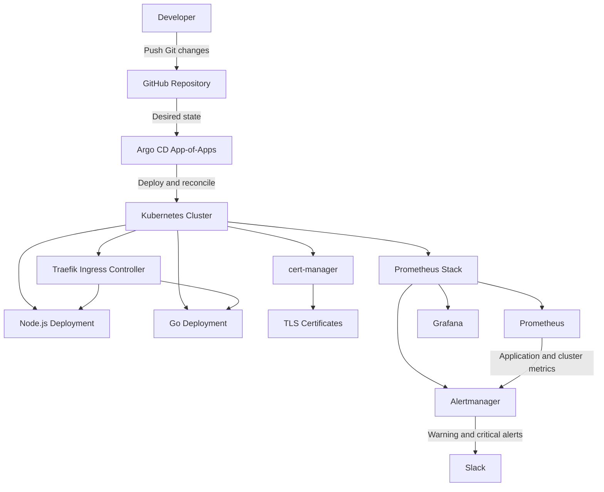

# Kubernetes GitOps Platform

A production-inspired DevOps and SRE portfolio project that deploys and operates Go and Node.js applications on Kubernetes through a GitOps workflow.

The platform uses Argo CD, Helm, Prometheus, Grafana, Alertmanager, Traefik, cert-manager, and Slack alerting. Infrastructure and application configuration are stored declaratively in Git and automatically reconciled to the Kubernetes cluster.

## Project Goals

- Demonstrate a practical GitOps delivery model for Kubernetes workloads
- Deploy and operate Go and Node.js applications with Helm and Argo CD
- Provide observability through metrics, dashboards, and actionable alerts
- Secure public endpoints with Traefik, cert-manager, and TLS certificates
- Apply operational practices that support reliable application delivery

## Architecture



## Technology Stack

| Area | Technologies |
|---|---|
| Container orchestration | Kubernetes |
| GitOps delivery | Argo CD, App-of-Apps pattern |
| Package management | Helm |
| Applications | Node.js, Go |
| Ingress | Traefik |
| TLS automation | cert-manager, ACME |
| Monitoring | Prometheus, kube-state-metrics, node-exporter |
| Visualization | Grafana |
| Alerting | Alertmanager, Slack Incoming Webhook |
| Infrastructure as Code | Terraform |
| Source control | GitHub |

## Repository Structure

```text
.
├── argocd/
│   └── apps/                # Argo CD Application manifests
├── cert-manager/            # Certificate management configuration
├── charts/                  # Helm chart configuration
├── golang/                  # Go application and deployment assets
├── monitoring/              # Monitoring-related configuration
├── nodejs/                  # Node.js application and deployment assets
├── terraform/               # Infrastructure as Code
└── traefik/                 # Ingress controller configuration
```

## GitOps Workflow

1. A configuration change is committed and pushed to the `main` branch.
2. Argo CD detects the desired state stored in Git.
3. Argo CD deploys or reconciles Kubernetes resources automatically.
4. Self-healing restores managed resources if their live state drifts from Git.
5. Prometheus monitors the cluster and applications after deployment.

The monitoring application uses automated sync, pruning, and self-healing:

```yaml
syncPolicy:
  automated:
    prune: true
    selfHeal: true
```

## Applications

The cluster runs two sample workloads in the `default` namespace:

| Application | Deployment | Replicas |
|---|---|---|
| Go service | `golang` | 3 |
| Node.js service | `nodejs` | 3 |

Both workloads are deployed and managed declaratively through the GitOps workflow.

## Observability and Alerting

The monitoring stack is deployed with `kube-prometheus-stack` and includes Prometheus, Grafana, Alertmanager, kube-state-metrics, and node-exporter.

### Alert Flow

```text
Kubernetes metrics
→ Prometheus evaluates alert rules
→ Alertmanager groups and routes alerts
→ Slack receives actionable notifications
```

### Alert Routing

| Alert category | Destination |
|---|---|
| `severity=critical` | Slack |
| `severity=warning` | Slack |
| `severity=info` or no severity label | Suppressed |
| `Watchdog` | Suppressed |

### Custom Application Alert

`ApplicationDeploymentUnavailable` monitors the Go and Node.js deployments.

It triggers when the number of available replicas is lower than the desired replica count for more than five minutes:

```promql
kube_deployment_status_replicas_available{namespace="default",deployment=~"golang|nodejs"}
<
kube_deployment_spec_replicas{namespace="default",deployment=~"golang|nodejs"}
```

The alert is labelled `severity: critical`, so Alertmanager routes it to Slack.

## Validation Performed

The following end-to-end checks have been completed:

- Argo CD application status verified as `Synced` and `Healthy`
- Alertmanager configuration verified from the live Kubernetes Secret
- Slack routing tested successfully with a manual `warning` alert
- Custom `PrometheusRule` created through Helm values and GitOps
- Prometheus Operator validation confirmed for the custom rule
- Prometheus API confirmed that `ApplicationDeploymentUnavailable` is loaded

## Useful Commands

Check Argo CD application health without installing the Argo CD CLI:

```bash
kubectl -n argocd get application monitoring \
  -o jsonpath='Sync Status: {.status.sync.status}{"\n"}Health Status: {.status.health.status}{"\n"}'
```

List custom and built-in Prometheus rules:

```bash
kubectl -n monitoring get prometheusrules
```

View the custom application availability rule:

```bash
kubectl -n monitoring get prometheusrule \
  monitoring-kube-prometheus-application-deployment-alerts \
  -o yaml
```

Check application deployments:

```bash
kubectl get deployments --all-namespaces
```

## Roadmap

- Add liveness and readiness probes to application workloads
- Define CPU and memory requests and limits
- Add Kubernetes security contexts and run containers as non-root
- Add NetworkPolicies for workload isolation
- Add CI checks for YAML, Helm, and Kubernetes manifests
- Add container image vulnerability scanning
- Document alert response runbooks
- Add screenshots of Argo CD, Grafana dashboards, and Slack alerts

## Key Skills Demonstrated

Kubernetes · GitOps · Argo CD · Helm · Terraform · Prometheus · Grafana · Alertmanager · Slack Alerting · Traefik · cert-manager · TLS · Observability · Site Reliability Engineering

---

## Platform Operations

This platform is managed through a GitOps workflow:

```text
GitHub → Argo CD → Kubernetes
```

### Current platform status

- Argo CD applications: `Synced` and `Healthy`
- HTTPS ingress: Traefik with cert-manager-managed TLS certificates
- Monitoring: Prometheus, Grafana, Kubernetes dashboards, and Node Exporter
- Secret management: Sealed Secrets synchronized across `default`, `monitoring`, and `traefik`
- Application delivery: Go and Node.js workloads managed declaratively from Git

### Argo CD applications

| Application | Purpose |
| --- | --- |
| `app-of-apps` | GitOps bootstrap and application orchestration |
| `golang` | Go workload deployment |
| `nodejs` | Node.js workload deployment |
| `monitoring` | Prometheus, Grafana, and Alertmanager stack |
| `sealed-secrets` | Sealed Secrets controller |
| `sealed-secrets-values` | Encrypted platform secrets managed from Git |

### Validation

```bash
# Check GitOps health
kubectl get applications -n argocd

# Verify Argo CD reverse-proxy mode
kubectl get configmap argocd-cmd-params-cm -n argocd \
  -o jsonpath='{.data.server\.insecure}'; echo

# Verify encrypted-secret reconciliation
kubectl get sealedsecrets -A
```

Argo CD runs behind Traefik with TLS terminated at the ingress layer. The Argo CD server accepts internal HTTP traffic through `server.insecure: "true"`, while public access remains protected by HTTPS.
