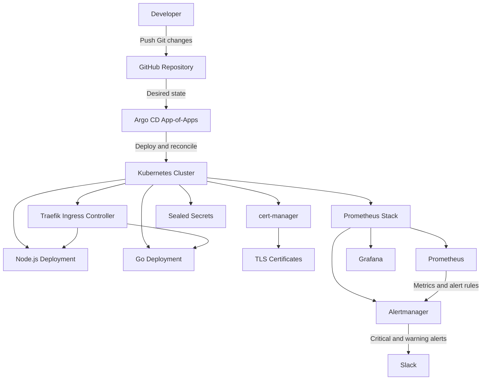

# Kubernetes GitOps Platform

A production-inspired DevOps and SRE platform that deploys and operates Go and Node.js workloads on Kubernetes through a GitOps workflow. Infrastructure, application delivery, observability, alerting, ingress, TLS, and encrypted secrets are defined declaratively in Git and reconciled automatically by Argo CD.

## Highlights

- **GitOps delivery:** Argo CD app-of-apps with automated sync, pruning, and self-healing.
- **Applications:** Go and Node.js workloads deployed declaratively with Helm and Kubernetes.
- **Secure edge:** Traefik routes public traffic over HTTPS; cert-manager manages TLS certificates.
- **Observability:** Prometheus, Grafana, kube-state-metrics, and Node Exporter provide cluster, workload, and node visibility.
- **Alerting:** Alertmanager routes critical and warning alerts to Slack.
- **Secret management:** Sealed Secrets keep sensitive configuration encrypted in Git.
- **Infrastructure as code:** Terraform keeps infrastructure provisioning reproducible.

## Architecture



## Technology Stack

| Area | Technologies |
| --- | --- |
| Container orchestration | Kubernetes |
| GitOps delivery | Argo CD, App-of-Apps |
| Package management | Helm |
| Applications | Go, Node.js |
| Ingress | Traefik |
| TLS automation | cert-manager, ACME |
| Metrics | Prometheus, kube-state-metrics, Node Exporter |
| Dashboards | Grafana |
| Alerting | Alertmanager, Slack webhook |
| Secret management | Bitnami Sealed Secrets |
| Infrastructure as code | Terraform |
| Source control | GitHub |

## GitOps Workflow

1. A change is committed and pushed to `main`.
2. Argo CD detects the desired state stored in Git.
3. Argo CD applies or reconciles the Kubernetes resources.
4. Automated pruning removes resources no longer declared in Git.
5. Self-healing restores managed resources when live state drifts.
6. Prometheus and Grafana expose the operational state after deployment.

The active Argo CD applications are `app-of-apps`, `golang`, `nodejs`, `monitoring`, `sealed-secrets`, and `sealed-secrets-values`. All are currently reconciled as `Synced` and `Healthy`.

## Repository Structure

```text
.
├── argocd/           # Bootstrap application, managed apps, certificate, and ingress route
│   └── apps/          # Argo CD Application manifests and GitOps-managed platform config
├── cert-manager/     # Certificate-management resources
├── charts/            # Helm chart and application values
├── golang/            # Go workload manifests
├── monitoring/        # Prometheus, Grafana, Alertmanager, rules, and dashboards
├── nodejs/            # Node.js workload manifests
├── sealed-secrets/    # Encrypted secret manifests
├── terraform/         # Infrastructure-as-code configuration
└── traefik/           # Traefik ingress-controller configuration
```

## Application Delivery

Two workloads run in the `default` namespace and are managed through the same GitOps workflow:

| Application | Deployment | Replicas |
| --- | --- | --- |
| Go service | `golang` | 3 |
| Node.js service | `nodejs` | 3 |

## Observability and Alerting

The monitoring stack is deployed with `kube-prometheus-stack` and includes Prometheus, Grafana, Alertmanager, kube-state-metrics, and Node Exporter.

```text
Kubernetes and application metrics
→ Prometheus evaluates alert rules
→ Alertmanager groups and routes alerts
→ Slack receives actionable notifications
```

`ApplicationDeploymentUnavailable` monitors the Go and Node.js deployments. It fires when available replicas remain below the desired count for more than five minutes, and it is labelled `severity: critical` for Slack routing.

```promql
kube_deployment_status_replicas_available{namespace="default",deployment=~"golang|nodejs"}
<
kube_deployment_spec_replicas{namespace="default",deployment=~"golang|nodejs"}
```

## Security and Access

- Public endpoints are protected with HTTPS certificates managed by cert-manager.
- Traefik terminates TLS at the cluster edge and routes traffic to the intended internal services.
- Argo CD runs behind Traefik with `server.insecure: "true"`: TLS remains enforced externally, while Traefik communicates with the Argo CD server over internal HTTP.
- Sealed Secrets are synchronized in the `default`, `monitoring`, and `traefik` namespaces, so plaintext credentials are not committed to Git.
- Git history provides an audit trail for platform and deployment changes.

## Validation Commands

```bash
# GitOps health
kubectl get applications -n argocd

# Argo CD reverse-proxy mode
kubectl get configmap argocd-cmd-params-cm -n argocd \
  -o jsonpath='{.data.server\.insecure}'; echo

# Sealed Secret reconciliation
kubectl get sealedsecrets -A

# Cluster workload status
kubectl get pods -A

# Prometheus rules
kubectl -n monitoring get prometheusrules
```

## Skills Demonstrated

Kubernetes · GitOps · Argo CD · Helm · Terraform · Prometheus · Grafana · Alertmanager · Slack Alerting · Traefik · cert-manager · TLS · Sealed Secrets · Observability · Site Reliability Engineering
